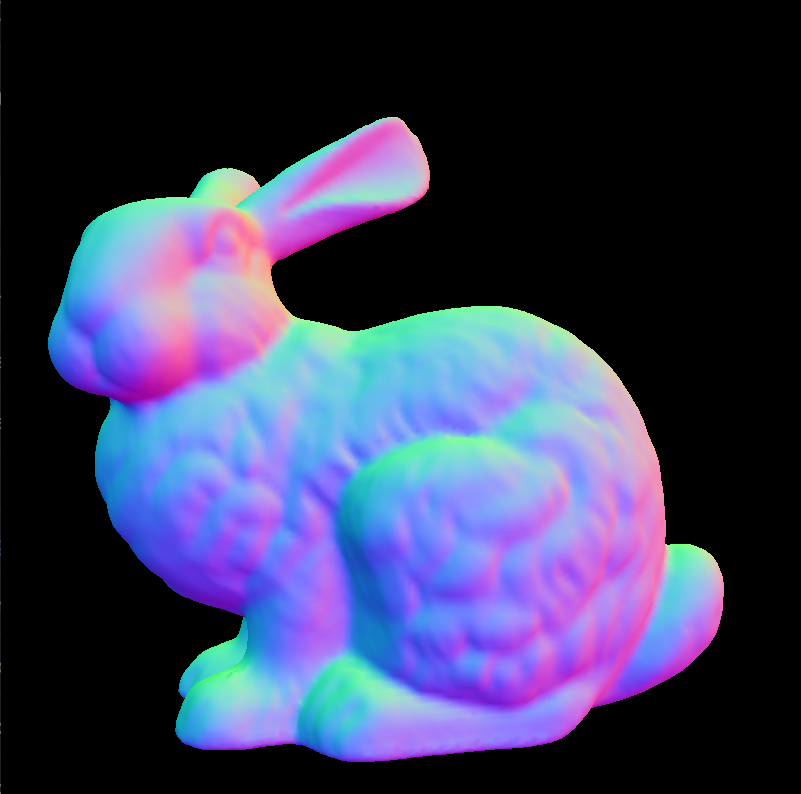
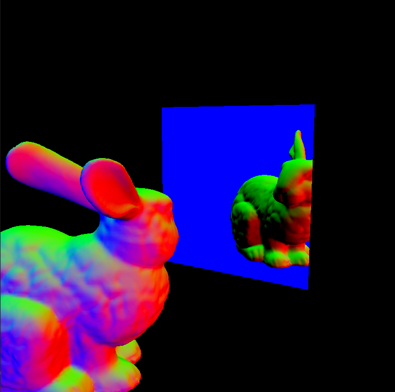

# Model Viewer

A program that loads and renders 3D models, written in C++ and OpenGL. 




This is a project where I learned concepts in OpenGL and computer graphics theory. So far, I learned vertex buffers, coordinate transformations, and OpenGL's tests (depth, stencil, etc.).

The `main` branch contains boilerplate code. Every branch (eg. `experimental/stencil-testing`) is built on top of `main`, exploring a concept or implementing a feature.

## Installation
This project uses vcpkg to manage dependencies and a manifest to list them.

## Building on Linux:
1. Prerequisites:
- Git
- CMake 3.15+
- OpenGL 3.0+
2. Clone repo:
```bash 
git clone https://github.com/leoQuin3/model-viewer.git
```
3. Change directory to project folder:
```bash
cd model-viewer/
```
4. Update vcpkg submodule:
```bash
git submodule update --init --recursive
```
5. Configure CMake:
```bash
cmake --preset debug
```
6. Build project:
```bash
cmake --build build/debug/ --config debug
```
7. Run project:
```bash
cd build/debug
./model-viewer
```

## Building on Windows:
> NOTE: Visual Studio is recommended. Building on Windows may also lead to issues due to package build failures.
1. Prerequisites:
- Visual Studio 2019+
- Git
- CMake 3.15+
- OpenGL 3.0+
2. Clone repo:
```bash 
git clone https://github.com/leoQuin3/model-viewer.git
```
3. Change directory to project folder:
```bash
cd model-viewer/
```
4. Update vcpkg submodule:
```bash
git submodule update --init --recursive
```
5. Open Visual Studio and select *Open a local folder*.
6. Choose project folder (`model-viewer`)
7. In Solution Explorer, right click on `CMakeLists.txt` and select *Configure model-viewer*
8. Build project with *Build* > *Build All* (Ctrl+Shift+B)
9. Set startup item to `model-viewer.exe` and run program with *Debug* > *Start Without Debugging* (Ctrl+F5)
	- Alternatively, navigate to directory `build/debug/` and run program `model-viewer.exe`
